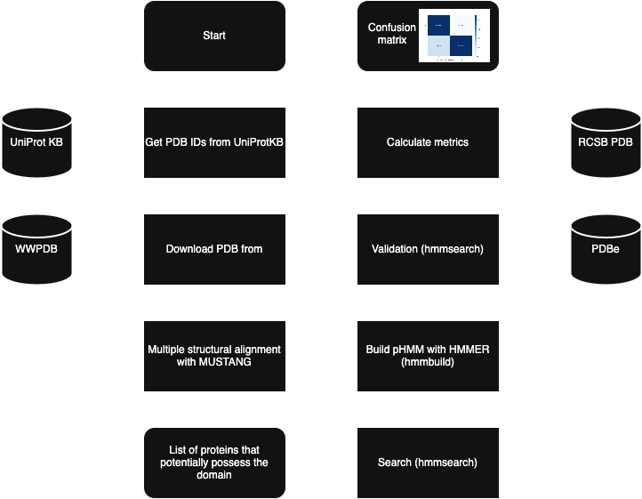
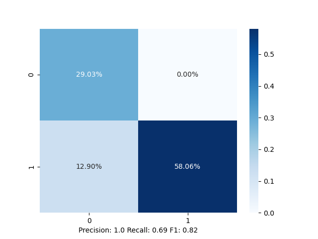

# HMMologs

## Pipeline


## Installation
1. Clone the repository:
```shell
git clone https://github.com/KinitaL/hmmologs.git
```
2. Create the conda env:
```shell
conda env create --file=env.yaml
```
3. Activate the env:
```shell
conda activate hmmologs
```

## Configuration
Fill the config.yaml file:
```yaml
# seed that has to be specified to make the random package
seed:  
# the directory that will be used as the root for the output of the script
output_dir: 
target:
  # InterPro domain ID
  interpro_id:
  # the number of structures that will be taken from UniProt to train a model
  structures_number_limit: 
pdb_filter:
  # PDB structures with the resolution lower than this threshold will be discarded
  resolution_threshold:
  # PDB structures with the number of residues larger than this threshold will be discarded
  max_residues_count: 
validation:
  # percentage of the training dataset that will be reused to validate recall of the model
  dataset_fraction: 
  # E-value threshold for hmmsearch routine on the validation step
  e_value_threshold: 
search:
  # the flag that specifies if we are going to do search or not
  do: 
  # the path to file with sequences that will be used to search. LEAVE EMPTY if you want to search against the whole PDB.
  db: 
  # the percentage of the sequences from the DB that will be used for search
  db_fraction: 
  # E-value threshold for hmmsearch routine on the search step
  e_value_threshold: 
```
## Execution
```shell
python hmmologs.py 
```

## Example
The statistics of the model made by this script for the Kunitz domain:
